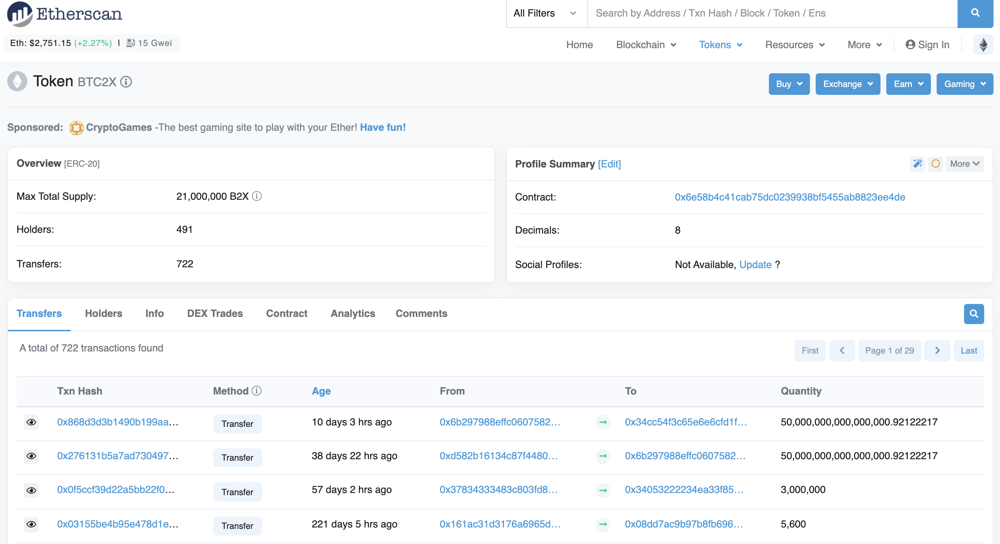
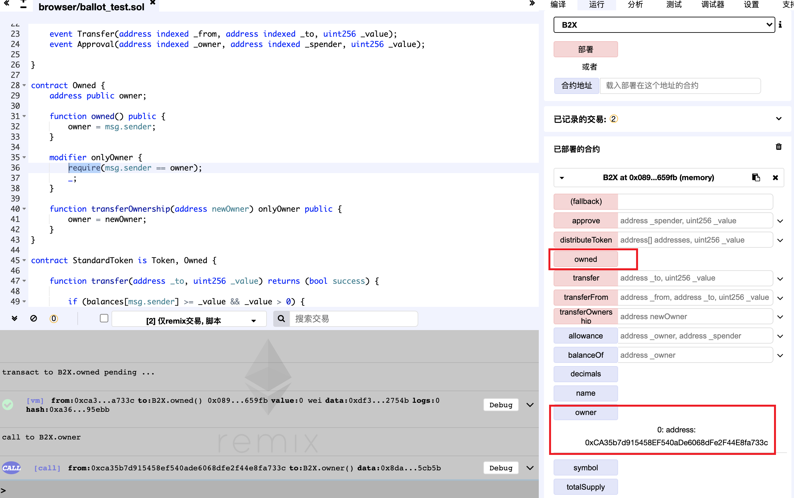
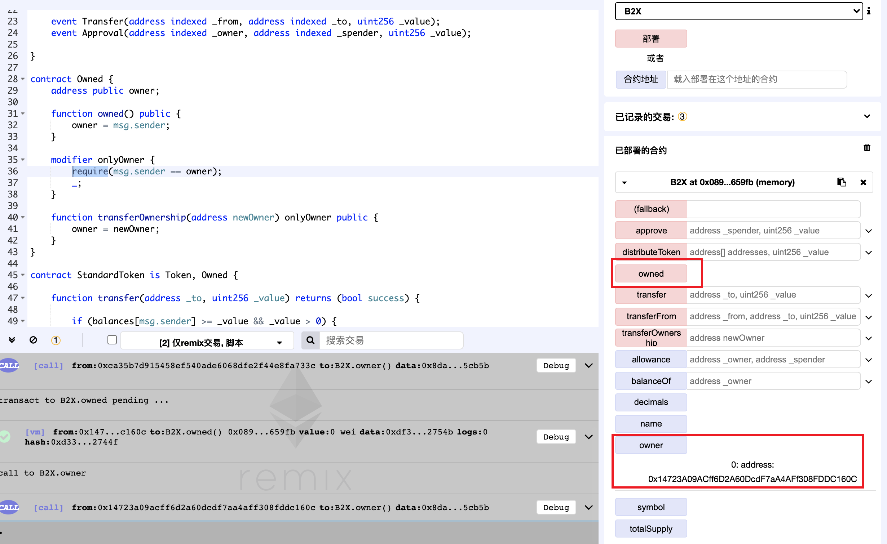

BTC2X
---------------
https://etherscan.io/address/0x6e58b4c41cab75dc0239938bf5455ab8823ee4de#code

  *Figure 1. BTC2X Token Information*

Improper Access Control (Unprotected Ownership)

	contract Owned {
	    address public owner;
	
	    function owned() public {
	        owner = msg.sender;
	    }
	
	    modifier onlyOwner {
	        require(msg.sender == owner);
	        _;
	    }
	
	    function transferOwnership(address newOwner) onlyOwner public {
	        owner = newOwner;
	    }
	}

The owned function of a smart contract implementation for BTC2X (B2X), a tradable Ethereum ERC20 token, has unprotected ownership, which allows the anyone to be the owner of this contract, including attakers. And attakers can modify the digital assets arbitrarily.

## Exploit

*Figure 2. Any account can be the owner of this smart contract.

*Figure 3. Change the owner to 0x1472.
