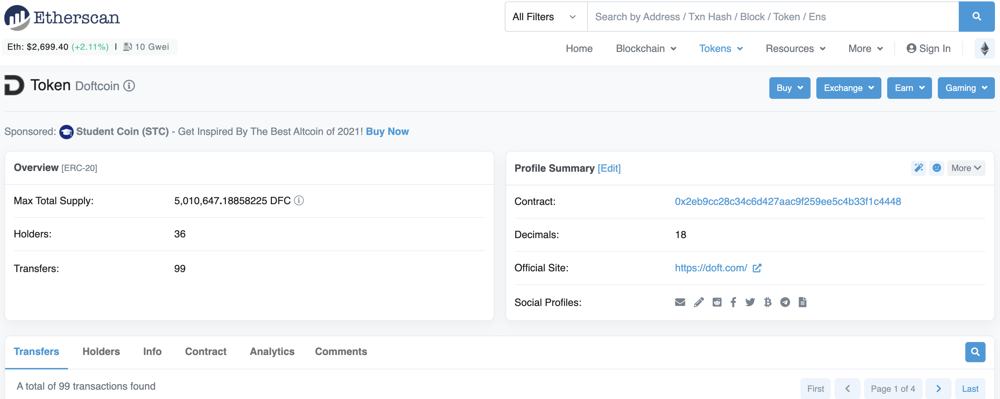
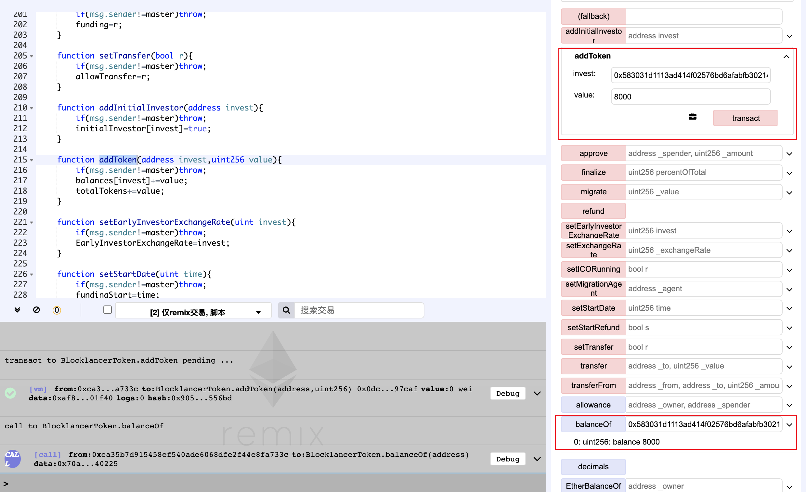
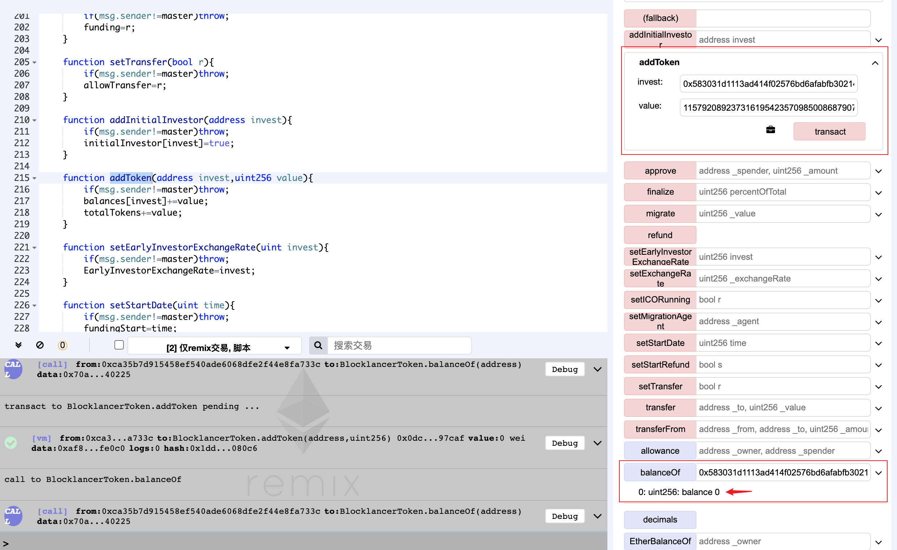

Doftcoin
---------------
https://etherscan.io/address/0x2eb9cc28c34c6d427aac9f259ee5c4b33f1c4448#code


  *Figure 1. Doftcoin Token Information*

Integer Overflow


	function mintToken(address _target, uint256 _mintedAmount) onlyOwner {
	  require (_target != 0x0);
	
	  //ownership will be given to ICO after creation
	  balanceOf[_target] += _mintedAmount;
	  _totalSupply += _mintedAmount;
	  Transfer(0, this, _mintedAmount);
	  Transfer(this, _target, _mintedAmount);
	}

The  Integer Overflow vulnerability in mintToken function similar to CVE-2018-11812. This vulnerability allows owner to add token to users. However, the unlimited value can change balance of user to zero (``` balanceOf[_target] += _mintedAmount;```).

## Exploit


*Figure 2. The Result of addToken() to target account.



*Figure 3. The Result of addToken() to attack target account!
