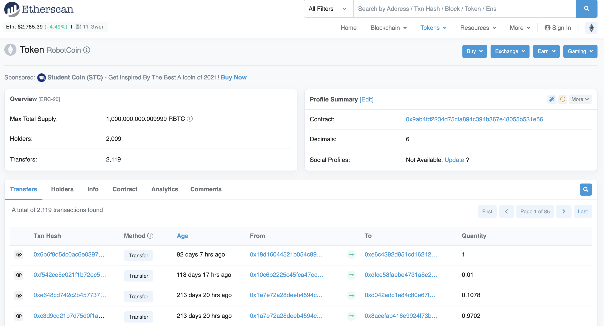
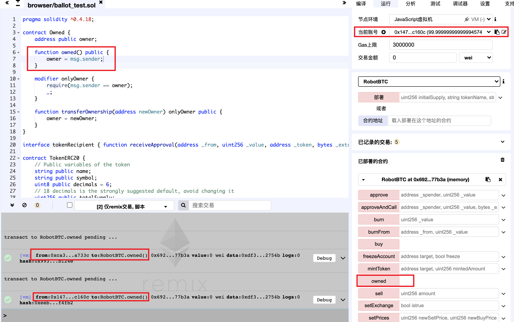

Doftcoin
---------------
https://etherscan.io/address/0x9ab4fd2234d75cfa894c394b367e48055b531e56#code

  *Figure 1. RobotCoin Token Information*

Improper Access Control (Unprotected Ownership)

	contract Owned {
	    address public owner;
	
	    function owned() public {
	        owner = msg.sender;
	    }
	
	    modifier onlyOwner {
	        require(msg.sender == owner);
	        _;
	    }
	
	    function transferOwnership(address newOwner) onlyOwner public {
	        owner = newOwner;
	    }
	}

The owned function of a smart contract implementation for RobotCoin (RBTC), a tradable Ethereum ERC20 token, has unprotected ownership, which allows the anyone to be the owner of this contract, including attakers. And attakers can increase the total supply of the digital assets arbitrarily.

## Exploit

*Figure 2. Any account can be the owner of this smart contract.
